# Rollen-Flow End-to-End — Onboarding-Plattform

**Live-Durchlauf gegen `onboarding.strategaizetransition.com` · Stand 2026-07-09**

Dieses Dokument zeigt für **jede der fünf Login-Rollen** einen vollständigen Ablauf: wie der Nutzer reinkommt, wo er landet, was er sieht und Schritt für Schritt tun kann — jeweils mit echten Screenshots aus der **Live-App**. Danach die drei **Rollen-Kombinationen** (wer wen anlegt/einlädt), die **Befunde** aus dem Durchlauf und was das Ganze für den späteren Strategieberater-„Mein Tag" bedeutet.

Grundlage: Für den Durchlauf wurden fünf **Test-Accounts** (je eine Rolle) plus ein Test-Mandant und eine Test-Kanzlei angelegt (E-Mails auf `@strategaize-e2e.test`). Es wurden keine echten Nutzer-Passwörter angefasst; die Test-Daten werden nach der Doku-Erstellung wieder restlos entfernt. Die Screenshots zeigen deshalb bewusst **frische, leere Accounts** — so ist der reine Rollen-Rahmen sichtbar, ohne fremde Inhalte.

---

## 0. Überblick — fünf Rollen, ein Login

Es gibt **einen einzigen Login** (`/login`, E-Mail + Passwort). Die „Login-Tiefe" entsteht nicht durch verschiedene Login-Seiten, sondern durch die **Rolle im Profil**, die nach dem Login automatisch auf den passenden Bereich leitet.

| Rolle | Wer ist das | Tenant-Bindung | Zielbereich | Zweck |
|---|---|---|---|---|
| `strategaize_admin` | Gründer / Strategaize-Team | keine (cross-tenant) | `/admin/*` | Betreibt die Plattform: alle Mandanten, Partner, Berater, Reviews, Mein Tag |
| `strategaize_berater` | Ausführender Strategaize-Berater | keine, aber zugewiesene Mandanten | `/admin/mein-tag` (Berater-Workspace) | Betreut die ihm zugewiesenen Mandanten |
| `tenant_admin` | GF / Inhaber eines Mandanten (Direktkunde, StB-Mandant oder Test) | 1 Tenant | `/dashboard` | Füllt das eigene Unternehmen aus: Erhebungen, Mitarbeiter, Handbuch |
| `employee` | Mitarbeiter des Mandanten | 1 Tenant | `/employee` | Beantwortet nur die ihm zugewiesenen Aufgaben |
| `partner_admin` | Steuerberater-/Partner-Kanzlei | 1 Partner-Tenant | `/partner/dashboard` | Verwaltet Kanzlei-Stammdaten/Branding, lädt Mandanten ein |

Absicherung in drei Schichten: **Middleware-Matrix** (welche Rolle welchen Pfad darf) → **Layout-Gates** (Shell je Rolle) → **Seiten-Re-Gates** (einzelne Admin-Seiten verschärfen auf `strategaize_admin`), dahinter **RLS** auf der Datenbank.

---

## 1. Gemeinsamer Einstieg — der Login

Alle Rollen starten hier. Kein Rollen-Auswahlmenü: der Nutzer gibt E-Mail + Passwort ein, die Rolle bestimmt danach das Ziel. Es gibt keinen Self-Signup an dieser Stelle („Zugang ausschließlich per Einladung"); ein `Passwort vergessen?`-Link ist vorhanden.

```html
<figure style="margin:1.5rem 0;">
  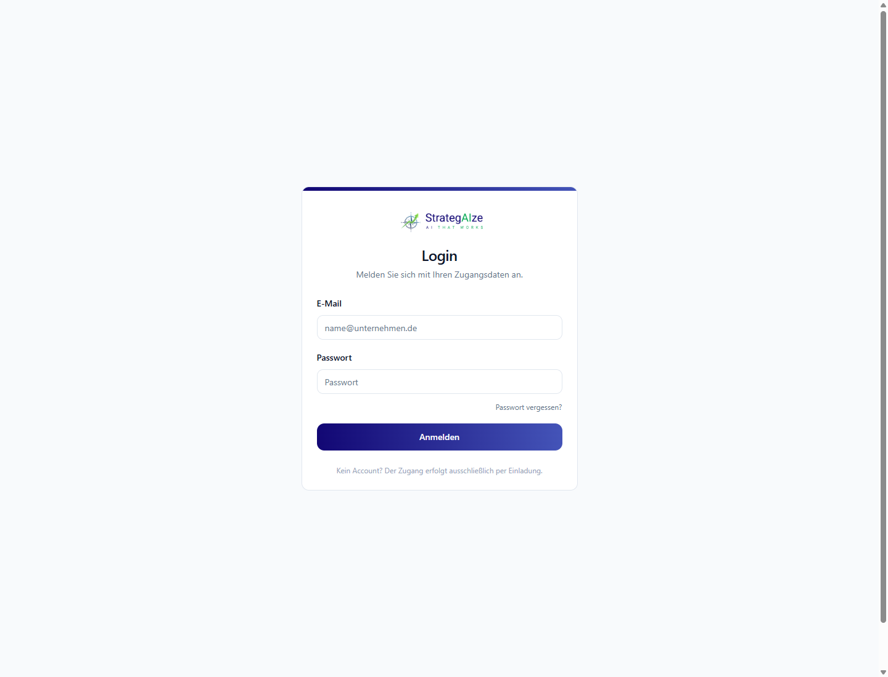
  <figcaption style="font-size:.85rem;color:#64748b;margin-top:.5rem;">Bild 1 — Gemeinsame Login-Seite (<code>/login</code>). Ein Login für alle Rollen.</figcaption>
</figure>
```

---

## 2. strategaize_admin — Plattform-Betrieb

**Wie er reinkommt:** Login → landet direkt auf `/admin/tenants`.
**Was er sieht:** die volle Admin-Shell mit Navigation *Mein Tag · Tenants · Partner · Berater · Reviews · Debrief · Funnel-Analytics · Text-Overrides · Helper-Texts · Mandanten-Demo · Handbuch*.
**Datensicht:** ALLES, cross-tenant (jeder Mandant, jeder Partner). Keine Tenant-Beschränkung.

### Schritt 1 — Tenant-Verwaltung (Landing)

Cross-Tenant-Statustabelle oben (Blöcke / Bridge / Mitarbeiter / Handbuch je Mandant), darunter Tenant-Karten mit Owner, Sessions, „Einladen", „User anzeigen", Reviews/Walkthroughs. Über „Neuer Tenant" legt der Admin einen Mandanten direkt an.

```html
<figure style="margin:1.5rem 0;">
  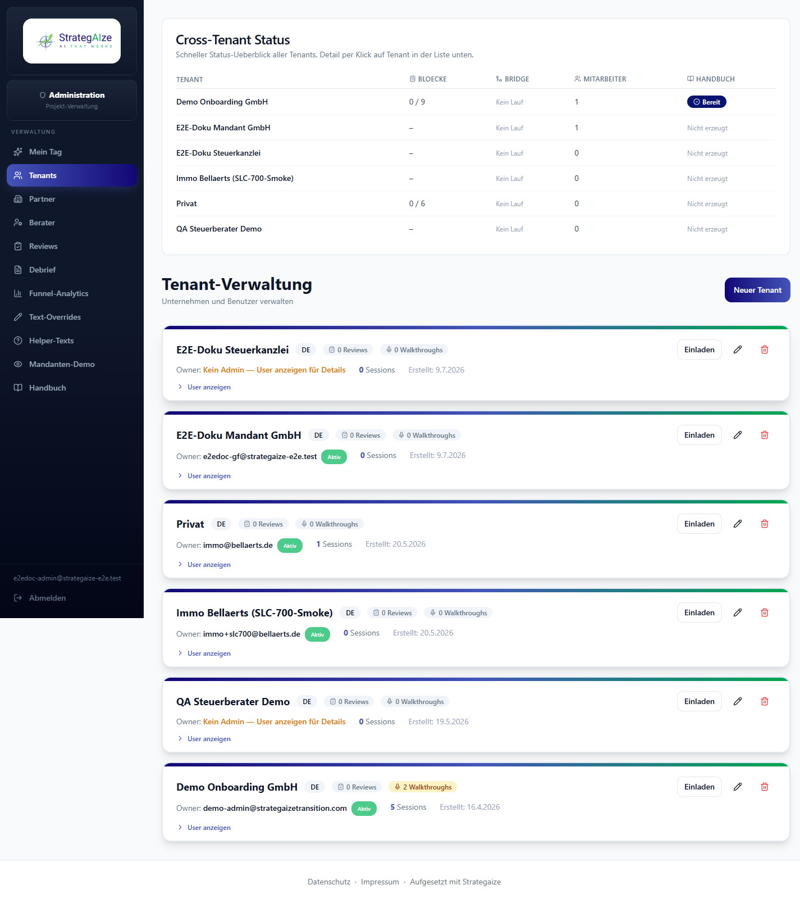
  <figcaption style="font-size:.85rem;color:#64748b;margin-top:.5rem;">Bild 2 — <code>/admin/tenants</code>: Cross-Tenant-Status + alle Mandanten-Karten.</figcaption>
</figure>
```

### Schritt 2 — Mein Tag (Admin-Workspace)

Der RAG-gestützte Arbeitsplatz des Admins: Standard-Berichte und freie Fragen über den gesamten Datenbestand.

```html
<figure style="margin:1.5rem 0;">
  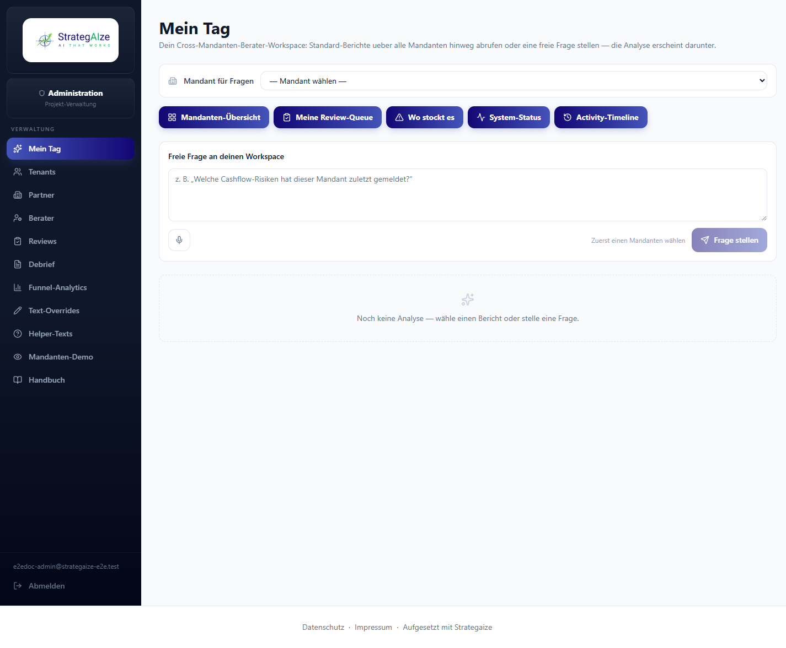
  <figcaption style="font-size:.85rem;color:#64748b;margin-top:.5rem;">Bild 3 — <code>/admin/mein-tag</code>: der Admin-Workspace (cross-tenant).</figcaption>
</figure>
```

### Schritt 3 — Berater anlegen & Mandanten zuweisen

Hier entsteht die ausführende Berater-Ebene: E-Mail eintragen → „Einladung verschicken" legt einen `strategaize_berater` ohne feste Kanzlei an. Darunter je Berater die **Zuweisungs-Checkboxen** (Kanzleien + Direkt-Kunden). Im Bild ist der Test-Berater angelegt und **„E2E-Doku Mandant GmbH" ist ihm zugewiesen** (Häkchen gesetzt).

```html
<figure style="margin:1.5rem 0;">
  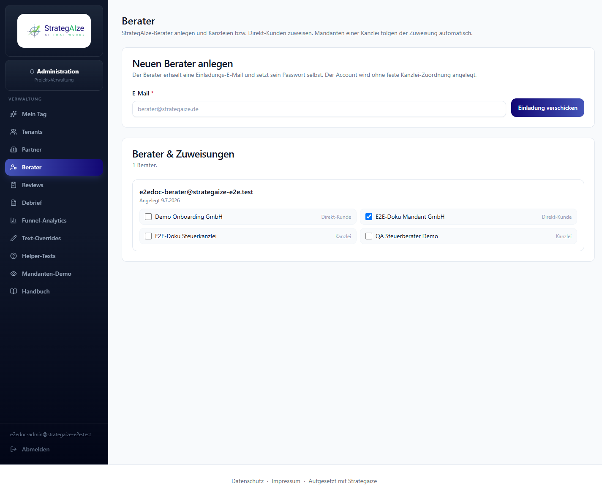
  <figcaption style="font-size:.85rem;color:#64748b;margin-top:.5rem;">Bild 4 — <code>/admin/berater</code>: Berater einladen + Mandanten/Kanzleien zuweisen. Diese Zuweisung steuert, was der Berater später sieht (siehe Abschnitt 3 und 7).</figcaption>
</figure>
```

### Schritt 4 — Partner-Organisationen (Steuerkanzleien)

Verwaltung der StB-Kanzleien; „Neue Partner-Organisation" legt eine Kanzlei an, die anschließend einen `partner_admin` per Einladung bekommt.

```html
<figure style="margin:1.5rem 0;">
  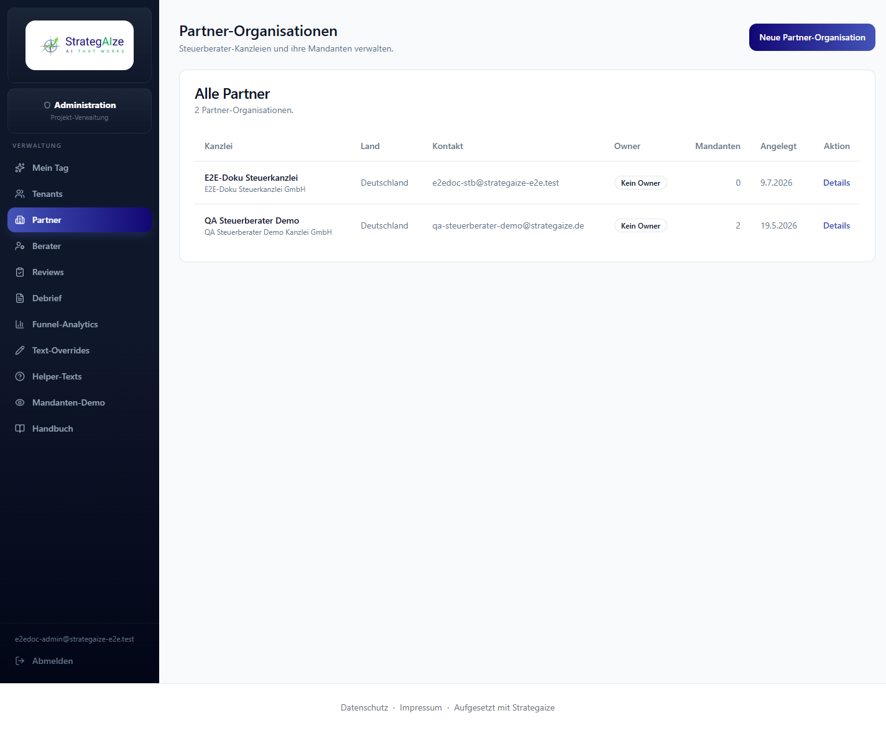
  <figcaption style="font-size:.85rem;color:#64748b;margin-top:.5rem;">Bild 5 — <code>/admin/partners</code>: Steuerberater-Kanzleien verwalten.</figcaption>
</figure>
```

**Was er kann:** Mandanten + Partner anlegen/löschen, alle einladen, Berater anlegen und Mandanten zuweisen, Reviews/Debrief freigeben, Tier setzen, RAG-Fragen (Mein Tag), alles auditieren.
**Grenze:** Es gibt nur diese eine Allmacht-Rolle für Strategaize — keine schwächere Team-Rolle.

---

## 3. strategaize_berater — der Berater-Workspace

**Wie er reinkommt:** Login. **Beobachtung:** Er landet zunächst auf dem generischen `/dashboard` mit leerer „Ihre Erhebungen"-Ansicht — **nicht** auf seinem Berater-Workspace. Das ist ein Befund (siehe Abschnitt 8, F1).

```html
<figure style="margin:1.5rem 0;">
  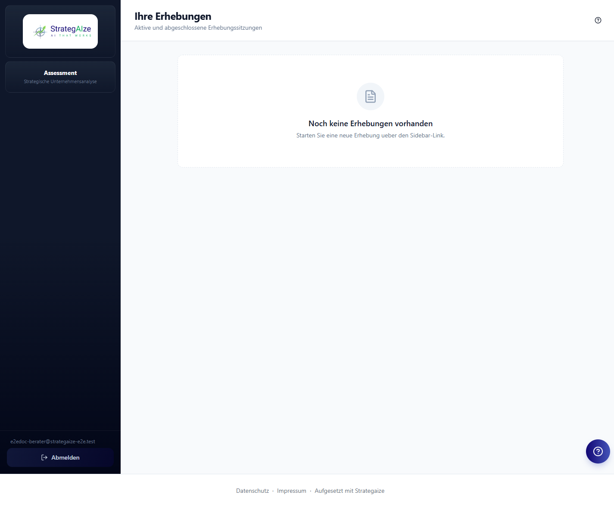
  <figcaption style="font-size:.85rem;color:#64748b;margin-top:.5rem;">Bild 6 — Tatsächliche Landung des Beraters nach Login: das generische, leere <code>/dashboard</code> (nicht der Workspace).</figcaption>
</figure>
```

### Der eigentliche Arbeitsplatz — `/admin/mein-tag`

Ruft er `/admin/mein-tag` auf, bekommt er die **gefilterte Berater-Shell**: „Beratung / Meine Mandanten", eine Liste **nur seiner zugewiesenen Mandanten**, Standard-Berichte (*Mandanten-Übersicht · Meine Review-Queue · Wo stockt es · Activity-Timeline*) und ein freies Frage-Feld mit Mandanten-Auswahl (Diktat möglich). Die Mandanten-Auswahl enthält **ausschließlich** den ihm zugewiesenen Mandanten — die Zuweisungs-Scope greift.

```html
<figure style="margin:1.5rem 0;">
  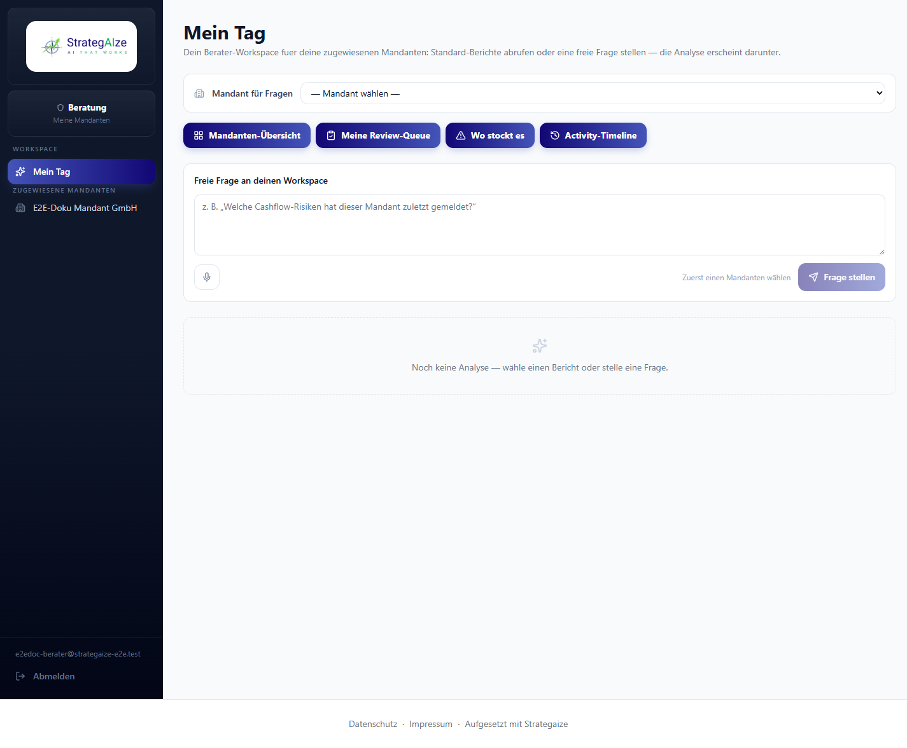
  <figcaption style="font-size:.85rem;color:#64748b;margin-top:.5rem;">Bild 7 — <code>/admin/mein-tag</code> als Berater: Workspace, gescoped auf die zugewiesenen Mandanten. Dropdown zeigt nur „E2E-Doku Mandant GmbH".</figcaption>
</figure>
```

**Was er kann:** Standard-Berichte abrufen und freie Fragen stellen — jeweils nur zu seinen zugewiesenen Mandanten.
**Grenze:** Sieht keine fremden Mandanten; keine Admin-Verwaltung (Tenants/Partner/Berater re-gaten auf `strategaize_admin`).

---

## 4. tenant_admin — GF / Inhaber eines Mandanten

**Wie er reinkommt:** Login → `/dashboard`. Bei frischem Mandanten erscheint ein **Onboarding-Assistent** (Schritt 1 von 4), der durch den Erststart führt.

```html
<figure style="margin:1.5rem 0;">
  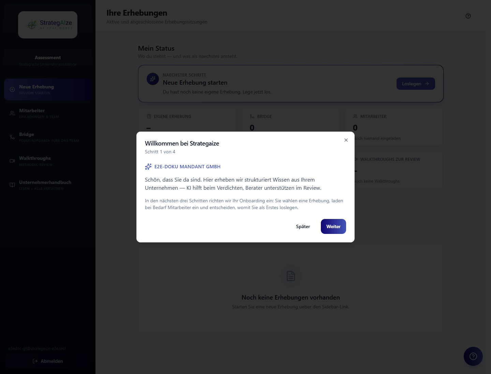
  <figcaption style="font-size:.85rem;color:#64748b;margin-top:.5rem;">Bild 8 — Willkommens-Assistent beim ersten Login eines neuen Mandanten.</figcaption>
</figure>
```

### Dashboard (nach dem Assistenten)

„Assessment"-Shell mit Sidebar-Aktionen *Neue Erhebung · Mitarbeiter · Bridge · Walkthroughs · Unternehmerhandbuch* und der „Mein Status"-Übersicht (nächster Schritt, Erhebungen, Team, Handbuch).

```html
<figure style="margin:1.5rem 0;">
  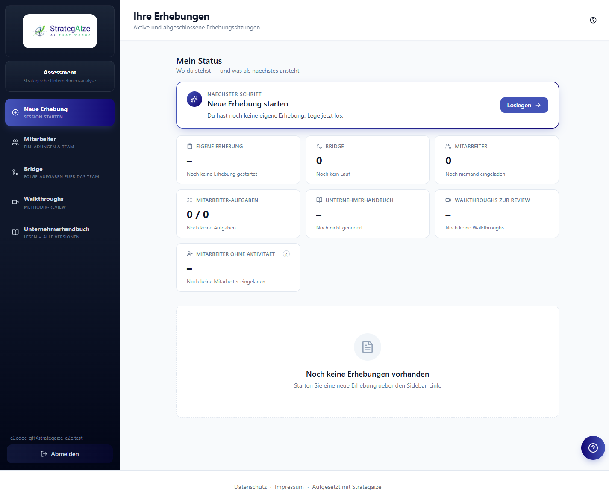
  <figcaption style="font-size:.85rem;color:#64748b;margin-top:.5rem;">Bild 9 — <code>/dashboard</code>: das GF-Cockpit des Mandanten.</figcaption>
</figure>
```

### Mitarbeiter einladen

Über „Mitarbeiter" (`/admin/team`) lädt der GF eigene Mitarbeiter (`employee`) ein.

```html
<figure style="margin:1.5rem 0;">
  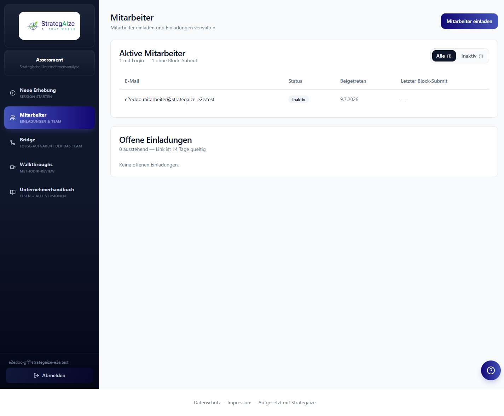
  <figcaption style="font-size:.85rem;color:#64748b;margin-top:.5rem;">Bild 10 — <code>/admin/team</code>: Mitarbeiter-Einladung durch den GF (siehe Kombination in Abschnitt 7).</figcaption>
</figure>
```

**Was er kann:** Erhebungen starten, Mitarbeiter einladen, Handbuch generieren, Bridge/Folge-Aufgaben, Diagnose anfordern. Nur der eigene Tenant.
**Hinweis StB-Vertikale:** Die StB-Fachmodule (`/dashboard/stb/*`) sind gebaut, aber hinter dem Feature-Flag `NEXT_PUBLIC_ENABLE_STB_VERTIKALE`, das **aktuell AUS** ist. Der Aufruf `/dashboard/stb` leitet zurück auf `/dashboard` — die StB-Screens sind erst nach Flag-Aktivierung (Build-Variable + Redeploy) sichtbar. In dieser Doku bewusst **nicht** aktiviert (siehe Abschnitt 8, F3).

---

## 5. employee — Mitarbeiter

**Wie er reinkommt:** Login → wird auf `/employee` geleitet (die Middleware sperrt für ihn `/dashboard`, `/admin`, `/capture`, `/partner`).
**Was er sieht:** die schlanke Mitarbeiter-Shell „Wissens-Erhebung" mit *Aufgaben* und *Walkthroughs*. Ein frischer Mitarbeiter sieht „Noch keine Aufgaben" — er wird per E-Mail benachrichtigt, sobald der GF ihm etwas zuweist.

```html
<figure style="margin:1.5rem 0;">
  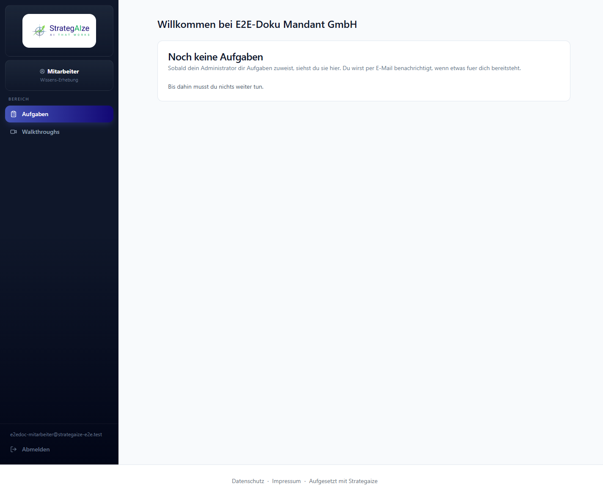
  <figcaption style="font-size:.85rem;color:#64748b;margin-top:.5rem;">Bild 11 — <code>/employee</code>: die Mitarbeiter-Sicht (frisch = leer). Sauberster Perimeter der Plattform.</figcaption>
</figure>
```

**Was er kann:** nur die ihm zugewiesenen Capture-Sessions beantworten und Walkthroughs aufnehmen (nur eigene, `owner_user_id`).
**Grenze:** kein Firmen-Einblick, kein Dashboard, kein Team.

---

## 6. partner_admin — Steuerberater-/Partner-Kanzlei

**Wie er reinkommt:** Login → `/partner/dashboard`.
**Was er sieht:** die Partner-Shell mit *Mein Dashboard · Meine Mandanten · Branding · Stammdaten · Funnel-Analytics*. Das Dashboard zeigt die Mandanten-Übersicht (hier leer) und die von Strategaize gespeicherten Kanzlei-Stammdaten.

```html
<figure style="margin:1.5rem 0;">
  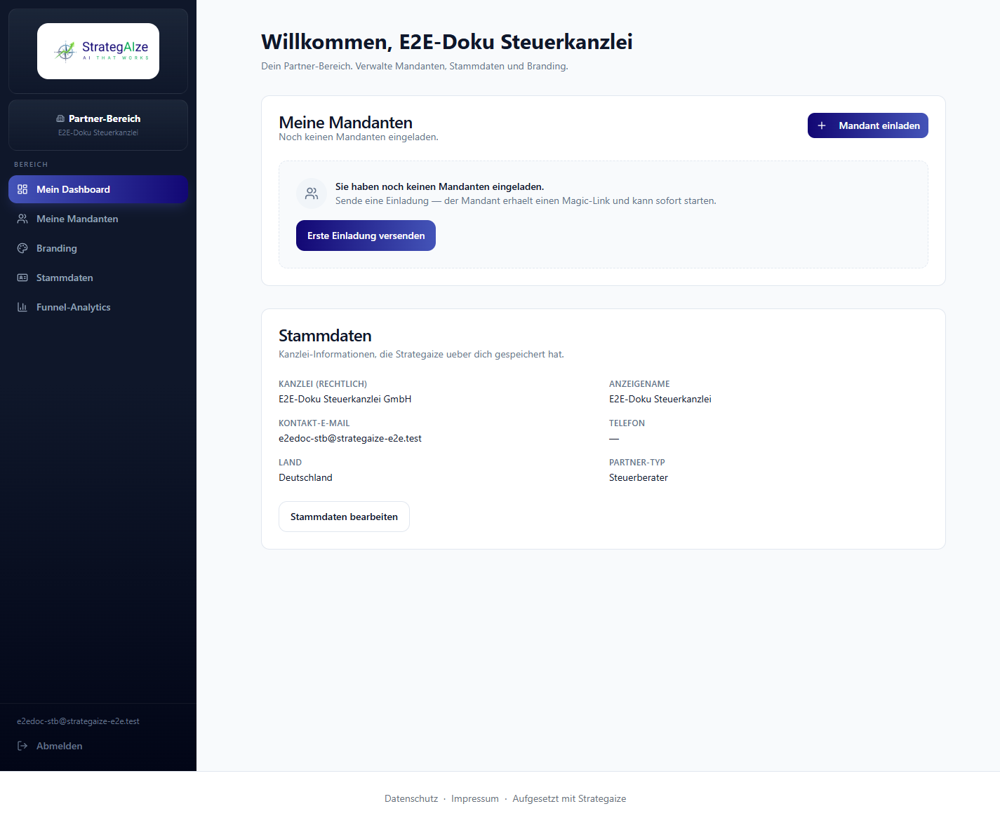
  <figcaption style="font-size:.85rem;color:#64748b;margin-top:.5rem;">Bild 12 — <code>/partner/dashboard</code>: Partner-Bereich der Kanzlei.</figcaption>
</figure>
```

### Mandant einladen

Über „Mandant einladen" (`/partner/dashboard/mandanten/neu`) lädt die Kanzlei einen Mandanten ein — dieser erhält einen Magic-Link und wird `tenant_admin` eines eigenen Mandanten-Tenants unter der Kanzlei.

```html
<figure style="margin:1.5rem 0;">
  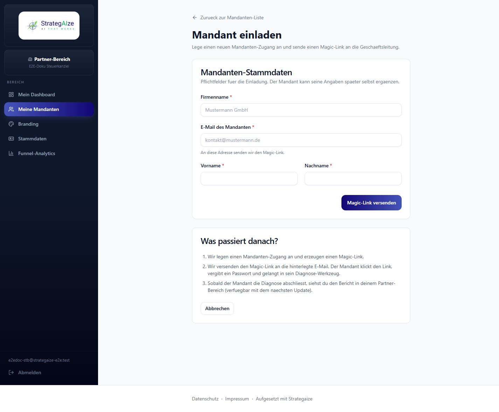
  <figcaption style="font-size:.85rem;color:#64748b;margin-top:.5rem;">Bild 13 — <code>/partner/dashboard/mandanten/neu</code>: Mandanten-Einladung (siehe Kombination in Abschnitt 7).</figcaption>
</figure>
```

**Was er kann:** Mandanten einladen/widerrufen, Branding/Logo pflegen, Stammdaten ändern; akzeptierte Mandanten read-only sehen.
**Grenze:** Kann die **eigene Kanzlei nicht als Unternehmen ausfüllen** (kein Zugang zu `/dashboard` oder `/capture`) und hat **keinen** Berater-Workspace à la „Mein Tag". Für „eigene Kanzlei ausfüllen" bräuchte der StB heute einen zweiten Login als `tenant_admin` eines eigenen Tenants.

---

## 7. Rollen-Kombinationen — wer legt wen an

### K1 — Admin → Berater → Mandanten-Zuweisung
`strategaize_admin` legt unter `/admin/berater` einen `strategaize_berater` an und **weist ihm gezielt Mandanten zu** (Häkchen, Bild 4). Der Berater sieht danach in seinem Workspace (`/admin/mein-tag`, Bild 7) **ausschließlich** die zugewiesenen Mandanten. Mandanten einer zugewiesenen Kanzlei folgen der Zuweisung automatisch. → Das ist die aufwendigste Kombination (Freischaltung, Zuweisung, Fortschritt-Sicht).

### K2 — partner_admin → Mandant
Die Kanzlei (`partner_admin`) lädt unter `/partner/dashboard/mandanten/neu` einen Mandanten ein (Bild 13). Der Mandant bekommt einen Magic-Link, setzt sein Passwort und ist danach `tenant_admin` seines eigenen Tenants (Typ `partner_client`) unter der Kanzlei.

### K3 — tenant_admin → employee
Der GF (`tenant_admin`) lädt unter `/admin/team` (Bild 10) Mitarbeiter ein. Der Mitarbeiter meldet sich an und landet in der Mitarbeiter-Sicht (`/employee`, Bild 11), wo er die ihm zugewiesenen Aufgaben abarbeitet.

```html
<figure style="margin:1.5rem 0;">
  <div style="display:grid;grid-template-columns:1fr;gap:.75rem;font-size:.9rem;">
    <div style="border-left:4px solid #4454b8;background:#f8fafc;padding:.75rem 1rem;border-radius:8px;"><strong>K1</strong> &nbsp; strategaize_admin &nbsp;→&nbsp; legt strategaize_berater an &nbsp;→&nbsp; weist Mandanten zu &nbsp;→&nbsp; Berater sieht nur diese</div>
    <div style="border-left:4px solid #00a84f;background:#f8fafc;padding:.75rem 1rem;border-radius:8px;"><strong>K2</strong> &nbsp; partner_admin (Kanzlei) &nbsp;→&nbsp; lädt Mandant ein &nbsp;→&nbsp; Mandant wird tenant_admin (partner_client)</div>
    <div style="border-left:4px solid #f2b705;background:#f8fafc;padding:.75rem 1rem;border-radius:8px;"><strong>K3</strong> &nbsp; tenant_admin (GF) &nbsp;→&nbsp; lädt employee ein &nbsp;→&nbsp; Mitarbeiter arbeitet Aufgaben in /employee ab</div>
  </div>
  <figcaption style="font-size:.85rem;color:#64748b;margin-top:.5rem;">Bild 14 — Die drei Anlege-/Einlade-Ketten im Überblick.</figcaption>
</figure>
```

---

## 8. Befunde aus dem Live-Durchlauf

**Befund F1 — Berater landet nach Login auf `/dashboard` statt im Workspace (Medium).**
Der `strategaize_berater` wird nach dem Login auf das generische, leere `/dashboard` geführt (Bild 6) statt auf seinen Berater-Workspace `/admin/mein-tag` (Bild 7). Die Middleware-Logik für den Login-Aufruf sieht `/admin/mein-tag` als Ziel vor, aber die tatsächliche Post-Login-Weiterleitung endet auf `/dashboard`. Anders als employee/partner_admin (die von der Middleware sauber in ihren Bereich umgeleitet werden) wird der Berater auf `/dashboard` **nicht** weggeleitet. Wirkung: verwirrender erster Eindruck, der Berater muss manuell auf „Mein Tag" navigieren. Keine Sicherheitslücke.

**Befund F2 — „Neue Erhebung" (`/capture/new`) wirft einen Server-Fehler (High, zu prüfen).**
Die Kern-Aktion des GF „Neue Erhebung starten" führte für den frisch angelegten Direktkunden-Mandanten zu einem Server-Fehler (`This page couldn't load`). Serverseitig ist es ein **ZodError** beim Validieren der Erhebungs-Blöcke: Block-`title` erwartet ein i18n-Objekt, erhielt aber einen String; zusätzlich fehlende Block-/Fragen-`id`s. D.h. die Template-/Block-Daten, die ein frischer `direct_client`-Mandant erhält, passen nicht zum aktuellen Block-Schema. Zu klären ist, ob auch Bestands-Mandanten betroffen sind. **Dieser Befund wurde nur dokumentiert, nicht gefixt** (Fix ist ein eigener Slice).

```html
<figure style="margin:1.5rem 0;">
  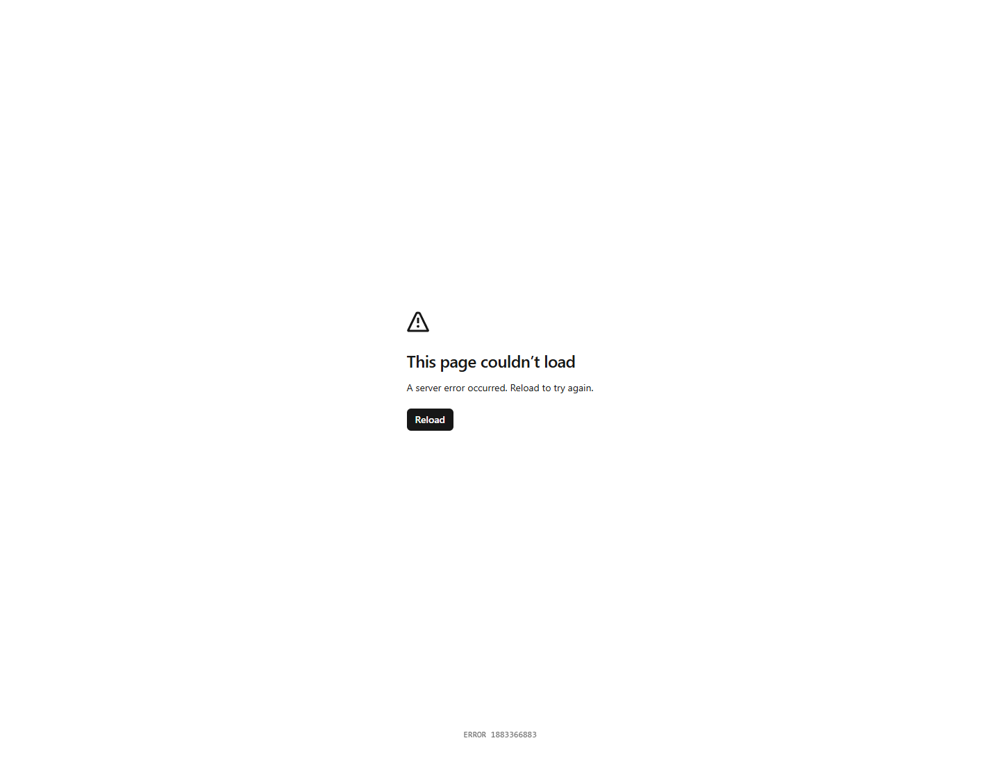
  <figcaption style="font-size:.85rem;color:#64748b;margin-top:.5rem;">Bild 15 — <code>/capture/new</code> als GF: Server-Fehler (ZodError, Block-Schema-Mismatch). Betrifft die zentrale GF-Aktion.</figcaption>
</figure>
```

**Befund F3 — StB-Vertikale hinter Flag (erwartet, kein Bug).**
`/dashboard/stb` ist wegen `NEXT_PUBLIC_ENABLE_STB_VERTIKALE=OFF` nicht erreichbar (Redirect auf `/dashboard`). So gewollt (Internal-Test-Mode). Zum Sichtbarmachen wäre die Build-Variable ON + Redeploy nötig — bewusst nicht Teil dieser Doku.

**Nebenbeobachtung.** Direkt nach dem Login zeigt die Adresszeile für employee/partner_admin kurz `/dashboard`, bevor die rollenrichtige Fläche rendert; der angezeigte Inhalt ist bereits korrekt der jeweilige Rollenbereich.

---

## 9. Was das für den Strategieberater-„Mein Tag" (OP) bedeutet

Der bestehende **Berater-Workspace** (`/admin/mein-tag`, Bild 7) ist die konkrete Blaupause für einen späteren Strategieberater-„Mein Tag":

- **Wo stehe ich?** → Liste der zugewiesenen Mandanten + Standard-Bericht „Mandanten-Übersicht".
- **Was ist zu tun?** → „Meine Review-Queue" (was auf Freigabe wartet).
- **Wo muss ich eingreifen?** → „Wo stockt es" (steckengebliebene Mandanten) + „Activity-Timeline".
- **Freie Frage** → RAG-Abfrage über die zugewiesenen Mandanten (mit Diktat).

Die Zuweisungs-Scope (Admin weist zu → Berater sieht nur diese) funktioniert bereits sauber und ist das richtige Fundament. Für einen produktiven Strategieberater-„Mein Tag" wären zwei Dinge zu adressieren: das saubere Post-Login-Landing (F1) und eine verdichtete „Handlungs-erst"-Übersicht statt der reinen Berichts-/Frage-Fläche.

Dieses Dokument ist bewusst **interne Selbsttest-Grundlage** — kein Kunden-Go-Live, keine Pilot-Empfehlung.
